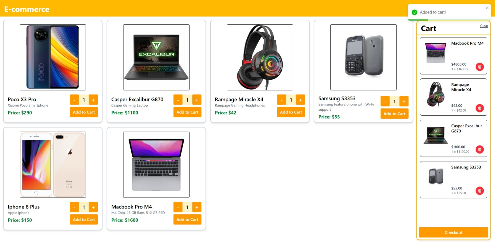
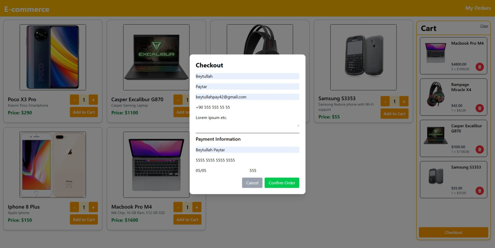
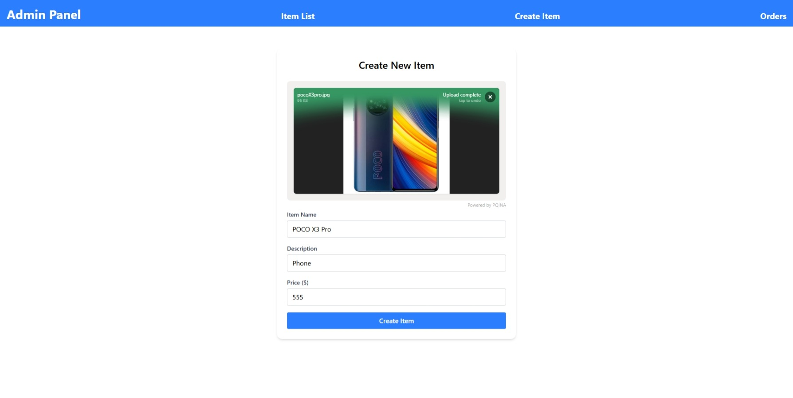
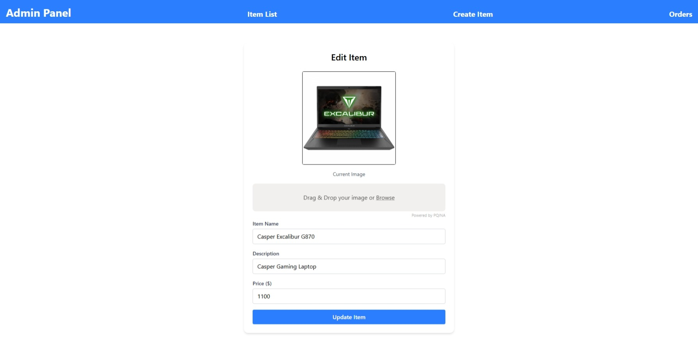
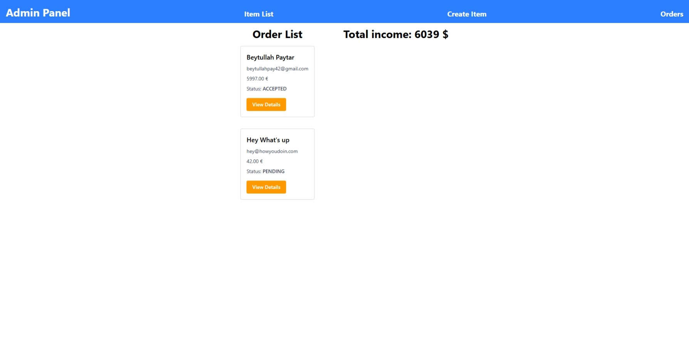

# E-Commerce Frontend (React)

This is the frontend application for a mock e-commerce app developed as the final project for **SE-016 - Web Applications** course at Estonian Entrepreneurship University of Applied Sciences during the **2024–2025 spring semester**.

Features include:

- Add items to cart, remove items, and clear cart
- Place orders and check order status
- Admin functions: create/update items, check and update orders
- Image upload with Filepond
- Simple styling with Tailwind CSS

---

## 🛠️ Technologies Used

- React (Vite + TypeScript)
- Tailwind CSS
- [Filepond](https://pqina.nl/filepond/) (image upload)

---

## ⚠️ Limitations

- No authentication system (no login/signup)
- No payment API integration
- UI is minimal and could use design polish

---

Backend API repository: https://github.com/Beytullahp42/e-commerce

---

## 📸 Screenshots

